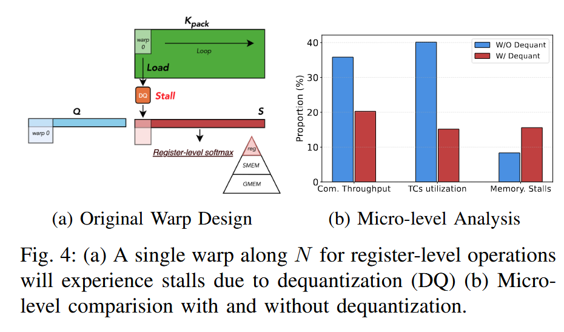

# BitDecoding: Unlocking Tensor Cores for Long-Context LLMs with Low-Bit KV Cache

## Problem
Existing systems suffer from slow decoding due to their **exclusive reliance on CUDA cores, neglecting Tensor Cores** -- the primary source of compute on modern GPUs.

1. First, **Tensor Cores require dequantizied low-bit data to be aligned with high-precision formats**, which is difficult in autoregressive decoding as the KV cache grows dynamically and must conform to Tensor Cores-specific layouts.
   - Fragment layouts vary across instructions and GPU generations
   - low-precision bitwidths exacerbate alignment issues.
   - dequantization can bottleneck execution:**naive low bit to FP16 casts are slow and require a friendly layout to run efficiently.**
2. The high cost of dequantization can **stall Tensor Cores execution**, reducing GPU occupancy due to mismatched workloads between CUDA cores and Tensor Cores.

3. supporting low-bit KV caches across diverse attention mechanisms and quantization algorithms -- with varying tensor-wise and channel-wise scaling -- demands a general yet hig hly optimized implementation.

## Motivation
1. modern language models employ Grouped-Query Attention and Multi-Quety Attention, which share a group of keys across multiple queries, enabling Tensor Cores to accelerate dot products in the self-attention mechanism.
2. Leveraging Tensor Cores can alleviate computational pressure on CUDA cores, enabling more efficient execution of dequantization.
3. newer GPU architectures support asynchronous execution on Tensor Cores, **allowing the extra operations introduced by the low-bit KV cache to overlap with computation**, further enhancing efficiency.

## Related Work

### Attention with separated low-bit KV-cache kernels
- advantages: flexible and readily supports many attention variants
- disadvantages: the isolated launches repeatedly load and store intermediate data, inflate global-memory traffic, and break on-chip data reuse

### Fused attention with low-bit KV-cache kernels on CUDA cores solely
- advanteges: without extensive kernel launches
- disadvantages: reduces occupancy and limits tile sizes, leaving fewer resources for the compute-heavy matrix multiplications

## Methodology

### methods for automatically inducing optimized layouts to exploit Tensor Cores

1. Inducing low-bit optimized layout with hardware instructions
- GPU Residual Kernel fuses computation, quantization and packing for newly generated KV tensors into registers structured for Tensor Cores.
- Packing Kernel fuses dequantization with computation

2. Aligning warps with residual KV cache to saturate Tensor Cores
- allocating a residual buffer with size matching the tiling capacity of Tensor Cores, we ensure that low-bit data aligns with the compute granularity of the hardware to fully utilize the computing ability of the computing unit.

3. Re-mapping layout for faster dequantization
- casing low-bit data to INT32 before mapping them to the interleaved Tensor Core layout following the 75316420 pattern.
- This layout enables efficient conversion of INT4/INT2 data to FP16 using the lop3 instruction for bitwise manipulation while aligning with the Tensor Core computation pattern.

4. Coordinating Residual and Packing Kernels with Configuration Setup
5. Unlocking warpgroup acceleration capabilities via smart uses of PTX-level instructions.
- C=AB, only A and C can be sourced from registers, while B must reside in shared memory.
- leveraging Hopper's STSM PTX instruction to store dequantized FP16 valued in shared memory efficiently, accessible for wgmma_SS operations.

### Warp-level parallelization strategies for dequantization
1. Enhancing warps paralleism for dequantization
   - Unlike the original warp partitioning strategy, which allocates multiple warps along the M dimension, the authors reduce the warp allocation along M to Wm=1 -- since the query length is typically less than 16 -- while increasing the number of warps along the N dimension(Wn)
2. Leveraging memory hierarchy for warps synchronization.

### A query transformation module supporting diverse attention variants
- reshaping the query tensor from [1, (g_q, h_{kv})] to [g_q, h_{kv}], effectively forming a larger Q tile without changing the semantics of attention or its KV-sharing pattern.

### A quantization kernel to support both tensor-wise and channel-wise scaling
1. Partitioning KV cache based on residual block size
- Prefilling: with context length L, we split the KV cache based on a Tensor Cores-aligned residual block size N_{r}. The first N_{p} = L - (L mod N_{r}) entries are quantized and packed into the low-bit KV cache using a fused quantization and packing operation. The remaining KV Tensor with size res_len = L mod N_{r} are stored in the half-presicion residual KV cache.
- At each decode step, the newly generated K,V tensors are appended to the residual cache and used for attention computation. This cache grows incrementally until it reaches the residual block size N_{r}

2. Optimizing reduction with wrap-level instructions
   - Optimizing asynchronous data movement
   - Asynchronous pipeline for overlapping CUDA cores and Tensor Cores.

### A dequantization kernel with a software-defined pipeline to coordinate CUDA and Tensor Cores execution for mix-precision operations
1. Optimizing asynchronous data movement
2. Asynchronous pipeline for overlapping CUDA Cores and Tensor Cores.